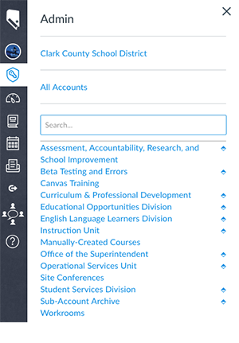
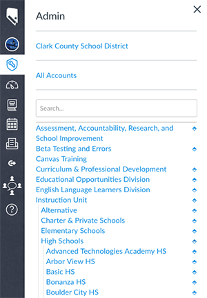
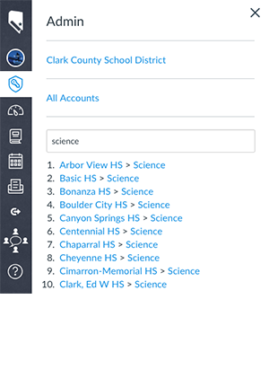

# Admin Tray - Sub Account Navigation

If you're a **Account Admin** of a Canvas LMS instance with a deep organization of sub accounts you have inevitably found yourself in one of *Dante's 9 Circles of Hell*, repetitively clicking *Sub Accounts* at each and every level as you drill down to where you need to go. At CCSD this includes a consortium of 4 instances and 15,000 sub accounts, and yet this only affects a handful of staff. We will share this to help anyone else who is trapped clicking.

This Throwback will add a searchable and expandable list of sub accounts to the Admin Tray.

Collapsed | Expanded | Search
------------ | ------------- | -------------
 |  | 

## Notes
- _Almost_* meets the requirements of Global Custom Navigation
- Handles consortiums of multiple instances

> *The "Search..." input placeholder and and "Reload" prompt are static and can be changed for language needs. Have not found a way dynamically handle this. :(

## Features
### localStorage
- Stored separatelyfor each instance (prod, beta, test)
- The sub account API results are stored in localStorage for repeated use.
- If localStorage is empty, account collection starts on page load and does not wait until the tray is opened for initialization.

### Interruption Handler
If API query (account collection) process is interrupted (chaning pages) it continues on the next page, with the next pagination request to the API. Once all the accounts are collected, the list is searchable and expandable.

### Localized Search
Searching happens using the stored data in localStorage.

### Reload
The ↻ button at the bottom of the menu will clear the data from localStorage and recollect the accounts. Use this when you or other admins have added or removed sub accounts.

### Filters
2 filters are available to customize the results and output

- `searchAccountFilter` account *names* which should be excluded from the search result breadcrumbs
- `accountFilter` account *ids* as strings that should be excluded from the tree altogether. For consortiums when not on the local instance include the global account id you want to filter.

Filters are set during initialization

```js
gcn_AdminTraySubAccountNav.init({
  searchAccountFilter: [
    "Live SIS Courses",
    "Sub-Account Archive"
  ],
  accountFilter: [
    "123456", // archive sub account relative to root
    "100000000123456" // archive sub account relative to others
  ]
});
```

## JS Setup
2 options with examples are provided for configuration

### CDN
You can host `gcn-ccsd-admin-tray-subaccount-nav.js` or minified version on an external source. The advantage of this is loading only for the users that need it, reducing the overall size of your Themes JavaScript file for other users.

Get the file [gcn-ccsd-admin-tray-subaccount-nav.cdn-setup.js](/custom-throwbacks/ccsd-admin-tray-subaccount-nav/gcn-ccsd-admin-tray-subaccount-nav.cdn-setup.js) and update it with the inline or minified code as follows:

```js
// requires the complete features of global-custom-nav.js
const globalCustomNav = {};
```

```js
// update with your own cdn host
script.src = `${your.cdn}/js/gcn-ccsd-admin-tray-subaccount-nav.min.js`;
```

### Inline
Get the file [gcn-ccsd-admin-tray-subaccount-nav.inline-setup.js](/custom-throwbacks/ccsd-admin-tray-subaccount-nav/gcn-ccsd-admin-tray-subaccount-nav.inline-setup.js) and update it with the inline or minified code as follows:

```js
// requires the complete features of global-custom-nav.js
const globalCustomNav = {};
```

```js
// replace/paste from gcn-ccsd-admin-tray-subaccount-nav.js or gcn-ccsd-admin-tray-subaccount-nav.min.js
const gcn_AdminTraySubAccountNav = (function() {})();
```

## CSS Setup

- If using the CDN setup, you'll probably want to append [gcn-ccsd-admin-tray-subaccount-nav.css](/custom-throwbacks/ccsd-admin-tray-subaccount-nav/gcn-ccsd-admin-tray-subaccount-nav.css) to your themes CSS file, along with the [global-custom-nav.css](/css/global-custom-nav.css)
- The CSS is included (and minified) for the `gcn-ccsd-admin-tray-subaccount-nav.inline-setup.js` version.

## Testing File
[gcn-ccsd-admin-tray-subaccount-nav.inline-dev.js](/custom-throwbacks/ccsd-admin-tray-subaccount-nav/gcn-ccsd-admin-tray-subaccount-nav.inline-dev.js) has the css and basic setup for testing

## Authors
- Clark County School District (Robert Carroll & Aaron Leonard)